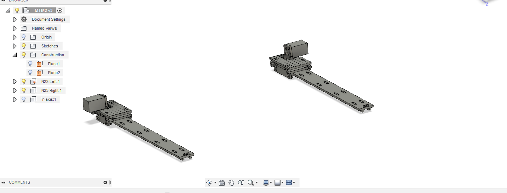
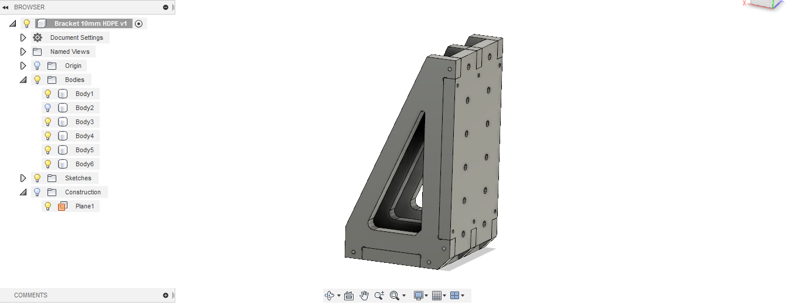
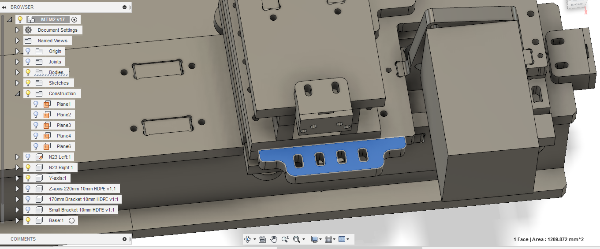

# Build Log

## Design Workflow

1. Figure out the rough machine dimensions you want to build.
2. Design each axis to fit the specification (Jake's RCT Gantries)
3. Fit all the axis in a neat configuration.
4. Design fixtures, connectors, bolt holes etc to hold everything in place (keep note on Rigidity).
5. Design fixtures/housings and routing for wires and control electronics.
6. Prep design for manufacture (Nester plugin for Fusion 360, Automatic dogbone).
7. Switch to CAM layout and create tool paths.
8. Mill out all the components and assemble the parts.

### Some useful lessons learned

1. Always start from the Z-axis and build outwards, lot easier than going the other way.
2. Rigidity is your friend.
3. Always note hole sizes before milling, eg 4.8mm hole for threading M5 screw.
4. Test the runout of your machine by doing a small pockect cut and measuring the dimensions. Change the bit diameter in Vcarve to offset the runout.
5. Double check the dimensions of your CAD file and check the material thickness before milling.
6. Mill plastic with a new single flute end mill. Go for max depth (5-10mm) and min Feed rate (15mm/sec).

The RCT Gantry can be found on Git lab at [rctgantries](https://gitlab.cba.mit.edu/jakeread/rctgantries)

For this machine we will be using the [N23 linear axis](https://gitlab.cba.mit.edu/jakeread/rctgantries/tree/master/n23_linearPinion) The CAD file and the BOM can be found on the Gitlab repository.

The first step is to **work out approximate dimensions** for the various axis depending on the requirement and material available. I went with the biggest machine I can make with the material available, which would be a bed size of roughly 3X2 Feet. But the tool can reach only 80% of that area owing to the design of the gantry.

Once the dimensions are fixed, its time to **import the design file into fusion 360.** The design is paramteric and you can change the parameters by going into **Modify>Change Paramters.** Update with the values you came up with.

The design gets updated with the current parameter values.

The z-axis with 220mm travel, is ready for manufacturing.

A similar process if used for the **X-axis** gantry.

I modified the design a bit to remove the bottom part of the gantry so that I can work on desigining a base for the machine.

A mirror of the axis is imported as a seperate component.

These two axis will form the basis of the machine. 

Design a new **Y-axis** based on the specificationa and import the file into the design as a seperate component.

Create mounting holes to fix the Y-axis to the two X-axis plates. I'll be using SHCS M5x20 screws to secure the two axis together.

Now the X and Y axis are done and its time to bring in the Z-axis. Import the **Z-axis** you designed as a seperate component and move it into place on top of the Y gantry.

This completes the 3-axis,

All the 3-axis are in place, now its time to design some fixtures to hold them together.

I designed a parametric HDPE bracket to hold the z-axis in place, the bracket will bolt on the gantry plates of the Y and Z axis, connecting them at 90 deg.

Import the bracket into the current modela and move it into place.

The next step is to **design a base for the machine.** Sketch the profile connecting the two X-axis togethr and extrude it as a part, make sure to add some tabs to connect the top and bottom plates together.

Once the profile is done, create a rectangular array with even spacing covering the length of the machine.

The webs will provide strength and rigidity to the base, Its time to design a base plate for the machien to rest on and provide a rigid foundation.

Using a similar process create a top bed for he machine, this will act as the machine bed where you can fix the stock for milling. 

Tip, design the top and bottom plates to be at right angles to each other, thereby providing strength and rigidity in both directions.

Vola! the machine is done!

### Accessories

Its time to design some accesories to help with wire routing and electroics placement.

**Screw in plates for Cable carrier**

These are small screw in plates which allow to attach the cable carrier which will the wires for the stepper motor and the spindle.

**ON/OFF Missile cover switch** for the coolness factor and possibly saftey, I think.

The switch will be on the front right of the machine, which will allow for easy access.

