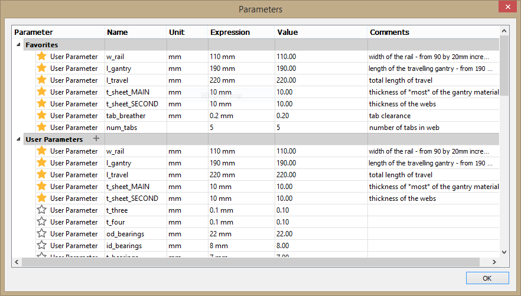

# Build Log

## Design Workflow

1. Figure out the rough machine dimensions you want to build.
2. Design each axis to fit the specification (Jake's RCT Gantries)
3. Fit all the axis in a neat configuration.
4. Design fixtures, connectors, bolt holes etc to hold everything in place (keep note on Rigidity).
5. Design fixtures/housings and routing for wires and control electronics.
6. Prep design for manufacture (Nester plugin for Fusion 360, Automatic dogbone).
7. Switch to CAM layout and create tool paths.
8. Mill out all the components and assemble the parts.

### Some useful lessons learned

1. Always start from the Z-axis and build outwards, lot easier than going the other way.
2. Rigidity is your friend.
3. Always note hole sizes before milling, eg 4.8mm hole for threading M5 screw.
4. Test the runout of your machine by doing a small pockect cut and measuring the dimensions. Change the bit diameter in Vcarve to offset the runout.
5. Double check the dimensions of your CAD file and check the material thickness before milling.
6. Mill plastic with a new single flute end mill. Go for max depth (5-10mm) and min Feed rate (15mm/sec).
7. The torsional rigidity of plastics is poor, try to limit the max length of plastic sections.
8. Use aluminum sections where convienent to help with Rigidity.

The RCT Gantry can be found on Git lab at [rctgantries](https://gitlab.cba.mit.edu/jakeread/rctgantries)

For this machine we will be using the [N23 linear axis](https://gitlab.cba.mit.edu/jakeread/rctgantries/tree/master/n23_linearPinion) The CAD file and the BOM can be found on the Gitlab repository.

The first step is to **work out approximate dimensions** for the various axis depending on the requirement and material available. I went with the biggest machine I can make with the material available, which would be a bed size of roughly 3X2 Feet. But the tool can reach only 80% of that area owing to the design of the gantry.

Once the dimensions are fixed, its time to **import the design file into fusion 360.** The design is paramteric and you can change the parameters by going into **Modify>Change Paramters.** Update with the values you came up with.

The design gets updated with the current parameter values.

The z-axis with 220mm travel, is ready for manufacturing.

A similar process if used for the **X-axis** gantry.

I modified the design a bit to remove the bottom part of the gantry so that I can work on desigining a base for the machine.

A mirror of the axis is imported as a seperate component.

These two axis will form the basis of the machine. 

Design a new **Y-axis** based on the specificationa and import the file into the design as a seperate component.

Create mounting holes to fix the Y-axis to the two X-axis plates. I'll be using SHCS M5x20 screws to secure the two axis together.

Now the X and Y axis are done and its time to bring in the Z-axis. Import the **Z-axis** you designed as a seperate component and move it into place on top of the Y gantry.

This completes the 3-axis,

All the 3-axis are in place, now its time to design some fixtures to hold them together.

I designed a parametric HDPE bracket to hold the z-axis in place, the bracket will bolt on the gantry plates of the Y and Z axis, connecting them at 90 deg.

Import the bracket into the current modela and move it into place.

The next step is to **design a base for the machine.** Sketch the profile connecting the two X-axis togethr and extrude it as a part, make sure to add some tabs to connect the top and bottom plates together.

Once the profile is done, create a rectangular array with even spacing covering the length of the machine.

The webs will provide strength and rigidity to the base, Its time to design a base plate for the machien to rest on and provide a rigid foundation.

Using a similar process create a top bed for he machine, this will act as the machine bed where you can fix the stock for milling. 

Tip, design the top and bottom plates to be at right angles to each other, thereby providing strength and rigidity in both directions.

Vola! the machine is done!

### Accessories

Its time to design some accesories to help with wire routing and electroics placement.

**Screw in plates for Cable carrier**

These are small screw in plates which allow to attach the cable carrier which will the wires for the stepper motor and the spindle.

**ON/OFF Missile cover switch** for the coolness factor and possibly saftey, I think.

The switch will be on the front right of the machine, which will allow for easy access.

## Fabrication

The first step is to nest the design within the stock to save material when cutting. I export the DXF file from Fusion 360 and import them to Rhino. Its much easier to nest in Rhino and it porvides some useful tools.

Starting with the z-axis first

The outer square represents stock size, for me its 1.2m X 1m.

#### Feeds and Speeds for cutting

**Feed rate: 15-20mm/sec**  
**Plunge rate: 20mm/sec**  
**Pass Depth: 5-10mm**  
**Step over: 80%**  

Time to start cutting. Get ready for some plastic snow.

Start with the Z-axis and work your way downwards.

The Z- axis all milled and ready for assembly.

### DIY Shoulder Bolts

Commercial shoulder bolts are expensive, and they are rated for a couple of tons, we don't need that kind of strength. A simply plastic bushing around a regular M5 screw will suffice for our application.

This is a cost effective solution and will allow for custom shoulder lengths for various sizes like M5 and M6.

Bearing assembly,

**M5 SHCS>M5 washer>Plastic Bushing>8mmID 10mmOD shim>M5 washer**

Use a similar method to make bearing assemblies to attach to the axis plates.

The finished axis will have twelve bearings to constarin it from all sizes.

Four of them will be used to preload the assembly to give a smooth motion.

The completed Z-axis with motor mount.

Working our way backwards, the next part is the bracket holding the Z-axis to the Y-axis.

There is two of them to provide some extra stability.

Assemble the bed with both side walls first and all the interconnecting Ribs in between.

The ribs connect the two ends together and gives a solid support between them.

The top and bottom plates can now be mounted on the base, make sure all the holes line up, a small chamfer on the tabs helps in assembling the peices together. The top and bottom plates are 90deg with respect to each other, this provides rigidity in both axes.

The entire base is assembled, both the x-axis gantires are installed and the Y-axis is connected between them using M5 bolts. Be sure to square the y-axis before fixing it to both the x-axes.

The Z-axis is coupled into the Y-gantry by using two 90 deg brackets. The brackets are screwed on both the plates and hold the axis firmly together at right angles. With this we complete the mechanical assembly of the machine. You can move the various axes and see how they behave, check for any tight spots or inconsistensies in motion.

## Connecting the Electronics

Now its time to hook everything up to the machine. We will start with the stepper motors.

Prep the stepper motors by connecting the pulley and aligning it with the shaft using the grub screws.

**Extra marks** if you learn to braid the 4 wires of the stepper motor, this will help reduce the electrical noise and look cool at the same time.

Follow the same procedure as before and start with the Z-axis. Connect motor to the motor plate using the M4 screws and pull a GT2 belt through them. The belt is secured on both sides using a small HDPE Tab and two screws. Pull the belt tight and screw the tabs to hold it in place.

Start with the Z-axis and do the same with Y-axis, attach the motors and pull the belt througha nd tighten it.

Time for some cable management, each motor has 4 wires, and 4 motors will have 16 wires which must be routed properly. Fortunately we can use a cool peice of hardware known as a **Drag chain/Cable carrier.** This will help manage all the wires in the machine, and allow for free movement, when the axes are in motion. We need two of them, one on each axis.

All the wires get hoocked up to our control board with is the **TinyG V8 board**. Its an awesome machine controller with a host of features. It can even do sixth order acceleration curves for smooth traversing of the axes. I love this board and its very easy to setup. On windows an application called **CoolTerm** can be used for terminal access to the board. And it is compatable with most G-code senders like **CNC.js**

Now one last thing before we power everything on, add an ON/OFF switch!

We are going to go for something cool, hence the **Missle cover Switch** It doubles as an emergency stop button as well.

Last but not least double check all the connections and power everthing on. Hopefully there is no magic smoke. Now we are ready to get going with the tuning and calibration.

## FabNC

The completed machine

