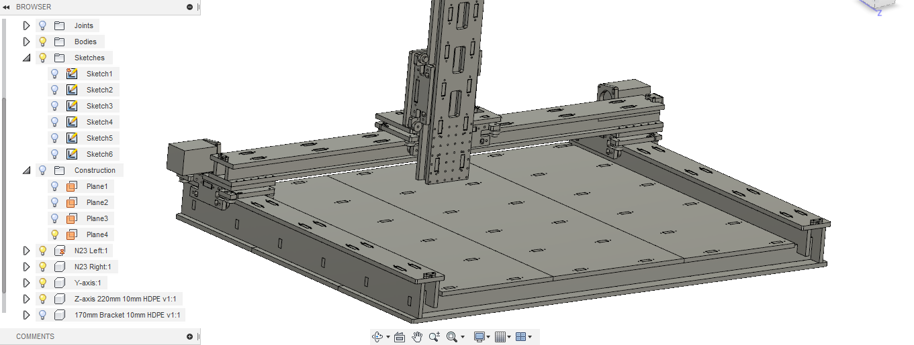
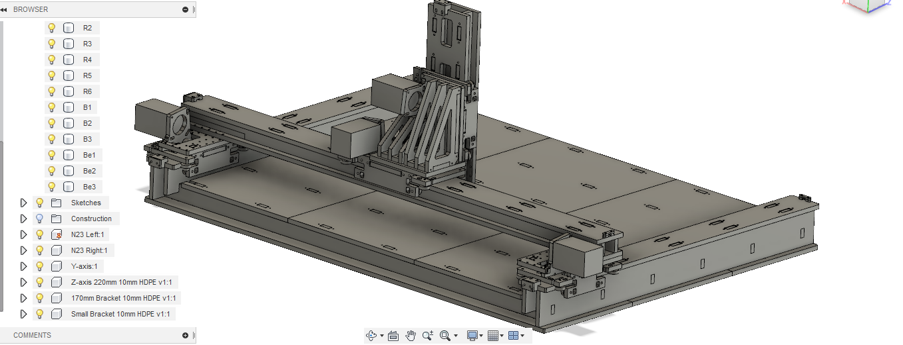

# FabNC
A Generalist 3-axis CNC machine based on Roller gantries.

This work is part of the Machines that Make project done in collaboration with MIT,USA. The research work done at Fab lab Trivandrum is supported by Kerala Startup Mission.

RCT-CNC is a generalist 3-axis CNC mahicne based on the RCT gantry designed by Jake Read, MIT. The design uses ball bearings to provide a smooth linear motion. The Gantry design is parametric and can be adopted for a variety of axis lenghts and material thickness.

The current machine is designed with a bed area of about 2X3 feet.

Detailed information on the buil can be found in the [Buil Log](https://github.com/rahulsarchive/FabNC/tree/master/Build%20Log)