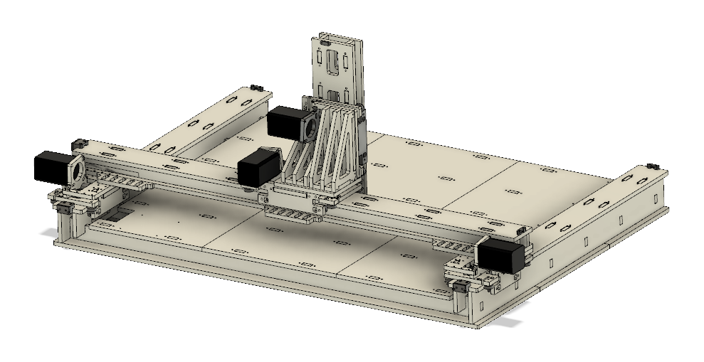

# FabNC
A Generalist 3-axis CNC machine based on Roller gantries.

This work is part of the Machines that Make project done in collaboration with CBA, MIT, USA. The research work done at Fab lab Trivandrum is supported by Kerala Startup Mission.

FabNC is a generalist 3-axis CNC mahicne based on the RCT gantry designed by Jake Read, MIT. The design uses ball bearings to provide a smooth linear motion. The Gantry design is parametric and can be adopted for a variety of axis lenghts and material thickness.

The current machine is designed with a bed area of about 2X3 feet.

## Design Workflow

1. Figure out the rough machine dimensions you want to build.
2. Design each axis to fit the specification (Jake's RCT Gantries)
3. Fit all the axis in a neat configuration.
4. Design fixtures, connectors, bolt holes etc to hold everything in place (keep note on Rigidity).
5. Design fixtures/housings and routing for wires and control electronics.
6. Prep design for manufacture (Nester plugin for Fusion 360, Automatic dogbone).
7. Switch to CAM layout and create tool paths.
8. Mill out all the components and assemble the parts.

### Some useful lessons learned

1. Always start from the Z-axis and build outwards, a lot easier than going the other way.
2. Rigidity is your friend.
3. Always note hole sizes before milling, eg 4.8mm hole for threading M5 screw.
4. Test the runout of your machine by doing a small square cut and measuring the dimensions. Change the bit diameter in Vcarve to offset the runout.
5. Double check the dimensions of your CAD file and check the material thickness before milling.
6. Mill plastic with a new single flute end mill. Go for max depth (5-10mm) and min Feed rate (15mm/sec).
7. The torsional rigidity of plastics is poor, try to limit the max length of plastic sections.
8. Use aluminum sections where convienent to help with Rigidity.

### Detailed information on the build can be found in the [**Build Log**](https://github.com/rahulsarchive/FabNC/tree/master/Build%20Log)

## FabNC V1

The completed machine

